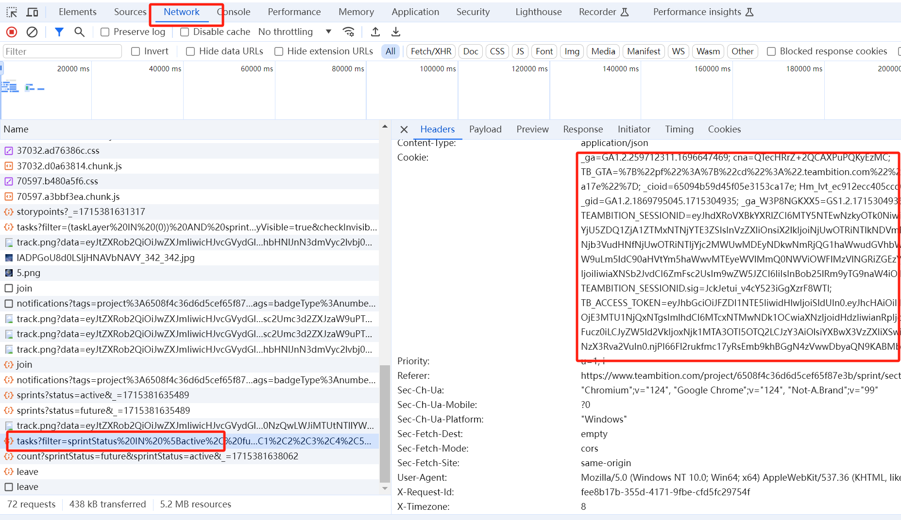
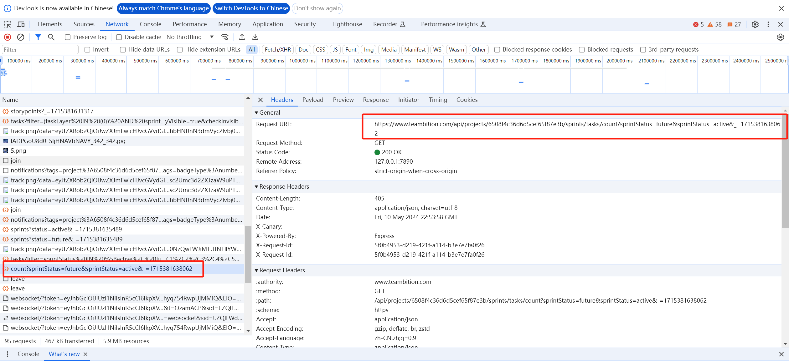
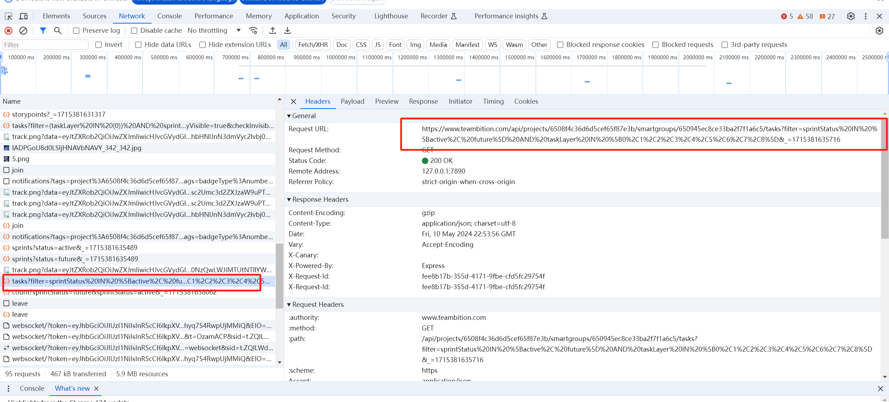
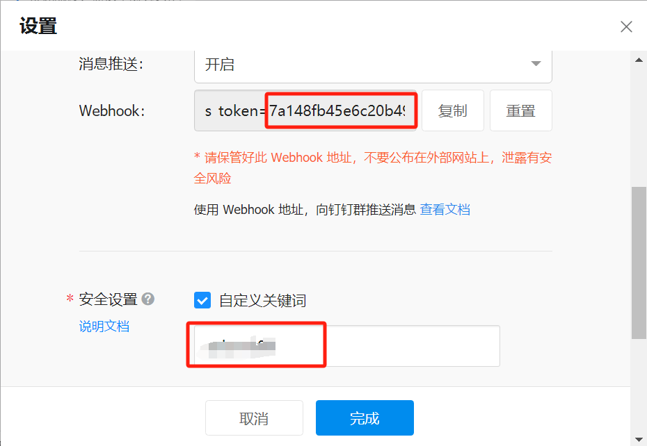

# Project Management Notifier

## Description

The pm-notifier is a project management notification tool to help PM manage progress.

## Features

- Send project management progress notification to members daily.
- Support custom scheduling of daily reminder times. 
- Support customization of notification content.
- Support the option to skip or not skip holidays
- Currently only support Teambition project management tools.
- Currently only support DingDing notification.

## Quick Start

1. Configure config/members.csv, the csv file includes name and phone number. The csv file format can reference to [members_sample.csv](config/members_sample.csv). You can export csv file from the Excel or other document then put it in config directory and rename to members.csv

2. Configure config/config.toml. First get Teambition cookie as following steps:
   - Open the Teambition project management page in the browser.
   - Open the developer tools.
   - Open the Network tab.
   - Find the "Cookie" field.
   - Copy the value of the "Cookie" field.
   - Paste the value of the "Cookie" field to config.toml file.


Below is an example of config.toml file.
```toml
[login]
login_type = "cookie"   # password, cookie, token
url = ""
username = ""
password = ""
cookie = "_ga=GA1.2.1234986066.1695107870; ; ...teambition_lang=zh"
token = ""
```

Second get Teambition task url as following steps:
   - Open the Teambition project management page in the browser.
   - Open the developer tools.
   - Open the Network tab.
   - Find the "tasks" and "count" request.
   - Copy the value of Request URL.
   - Paste "count" Request URL to  task_iteration_list_url filed of config.toml file.
   - Paste "tasks" Request URL to  task_list_url filed of config.toml file.



Below is an example of config.toml file.
```toml
[project]
task_iteration_list_url = "https://www.teambition.com/api/projects/6508f4c********f87e3b/sprints/tasks/count?sprintStatus=future&sprintStatus=active&_=1696823764388"
task_list_url = "https://www.teambition.com/api/projects/6508f4c36d6d5cef65f87e3b/smartgroups/6508f4c********f87e3b/tasks?filter=_sprintId%3D{}%20AND%20taskLayer%20IN%20%5B0%2C1%2C2%2C3%2C4%2C5%2C6%2C7%2C8%5D&_=1696823762146" # 注意{}作为占位符，用来替换参数，Request URL粘贴过来后需要改成这个格式
task_list_max_size = 200
task_deadline_format = "2006-01-02T15:04:05Z" # 任务截止时间的格式
[project.field_mapping]
executor_name = "executor.name"  # 任务执行者名称字段
task_name = "content"      # 任务名称字段
task_done = "isDone"      # 任务是否完成字段
task_deadline = "dueDate"  # 任务截至时间字段
```

Last get DingDing robot token as following steps:
   - Open the settings for the DingTalk group.
   - Click the "添加机器人" button.
   - Click the "自定义" button.
   - Click the "复制" button.
   - Paste the value of the "webhook"  and "safe setting" field to config.toml file.


Below is an example of config.toml file.
```toml
[notification]
type = 0 # 0钉钉 1企业微信 2飞书
webhook = ""
token = "YOUR TOKEN" # like 6e239xxxxxxxxxxxxxxxxxxxxxxxxxxxxxxxxxxxx690f0
key = "YOUR KEY"
```

3. Run the program.
```shell
go build -o pmn
nohup ./pmn > pmn.log 2>&1 &
```


## Notice

Default, notification will not send, when today is chinese holiday.